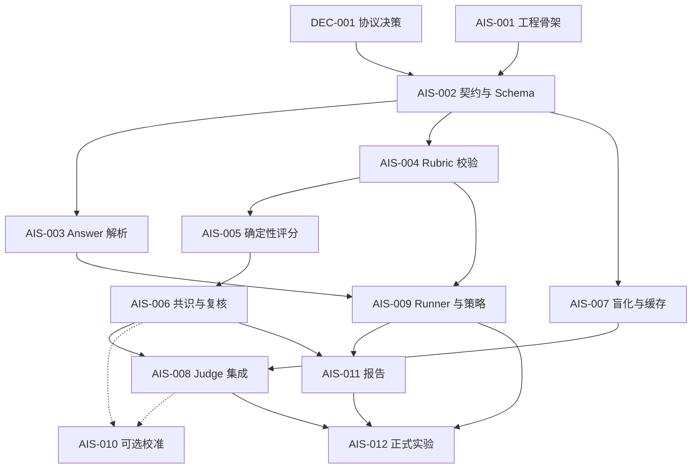

# AI Score v1 任务控制面

设计源：[docs/ai-scoring-design.md](../ai-scoring-design.md)

本目录是 `semantic_outcome_v1` 的可执行任务清单。设计约束以设计文档为准；任务卡只负责限定实现范围、依赖、验收和交付证据。

## 当前控制状态

- 工作模式：Execute
- 当前分支：`ai-score-v1`
- 基线状态：初始基线为 `edc7fbdfbf819da85275fc54cc7107a9fbb250be`；实现卡派发前必须填写完整 `Expected HEAD`。
- 用户工作区：已有 `.gitignore`、设计文档及本地 Skill 改动，不得清理或重置。
- 协议决策：`DEC-001` 已 `VERIFIED`。

只有在依赖已完成、任务卡范围明确、独立工作树干净且 `Expected HEAD` 已固定时，任务才可从 `DRAFT` 提升到 `READY`。

## 任务总览

| ID | 结果 | 状态 | 依赖 |
|---|---|---|---|
| `DEC-001` | 冻结 v1 协议与实验决策 | VERIFIED | none |
| `AIS-001` | 建立可测试的 Python 工程骨架 | INTEGRATED | 基线 commit |
| `AIS-002` | 定义并验证全部数据契约和 Profile | DRAFT | DEC-001, AIS-001 |
| `AIS-003` | 保存原始响应并生成 Agent Answer | DRAFT | AIS-002 |
| `AIS-004` | 加载 Profile 并验证 GT Rubric | DRAFT | AIS-002 |
| `AIS-005` | 确定性计算 item、维度、总分和 cap | DRAFT | AIS-004 |
| `AIS-006` | 形成多 Judge 共识和人工复核有效分 | DRAFT | AIS-005 |
| `AIS-007` | 生成盲评输入、digest 与缓存键 | DRAFT | AIS-002 |
| `AIS-008` | 集成 Claude Code CLI Judge、提示和仲裁调用 | DRAFT | AIS-006, AIS-007 |
| `AIS-009` | 运行 Agent 并独立采集策略/成本指标 | DRAFT | AIS-003, AIS-004 |
| `AIS-010` | 可选建立三个 Profile 的人工校准诊断 | DRAFT | AIS-006, AIS-008 |
| `AIS-011` | 生成 absolute、paired 和成本报告 | DRAFT | AIS-006, AIS-009 |
| `AIS-012` | 端到端冻结并执行正式实验 | DRAFT | AIS-008, AIS-009, AIS-011 |

## 依赖与建议批次

- 批次 0：完成 `DEC-001`，创建基线 commit。
- 批次 1：`AIS-001`。
- 批次 2：`AIS-002`。
- 批次 3：可并行执行 `AIS-003`、`AIS-004`、`AIS-007`，写入范围不得重叠。
- 批次 4：依次执行 `AIS-005`、`AIS-006`；`AIS-009` 可在 `AIS-003/004` 后独立推进。
- 批次 5：`AIS-008`；`AIS-010` 可选且不阻塞后续批次。
- 批次 6：`AIS-011`。
- 批次 7：`AIS-012`。

## 设计覆盖

| 设计章节 | 落地任务 |
|---|---|
| §1–§4 背景、目标、架构边界 | DEC-001, AIS-001 |
| §5–§7 维度、Profile、GT Rubric | DEC-001, AIS-002, AIS-004, AIS-010 |
| §8 Agent 与运行 Artifact | AIS-002, AIS-003, AIS-009 |
| §9 盲评输入与注入防护 | AIS-007, AIS-008 |
| §10–§12 Judge 输出、聚合、critical | DEC-001, AIS-005, AIS-008 |
| §13–§14 共识、稳定性、人工复核 | DEC-001, AIS-006, AIS-008 |
| §15 工具策略与过程指标 | AIS-009, AIS-011 |
| §16 Absolute score；Pairwise 为 v1 非目标 | AIS-011 |
| §17 Artifact 布局 | AIS-002, AIS-003, AIS-009, AIS-012 |
| §18 代码目录与职责 | AIS-001 |
| §19–§20 报告与版本隔离 | AIS-002, AIS-007, AIS-011 |
| §21 可选校准诊断 | DEC-001, AIS-010 |
| §22–§24 实施、未决项、推荐结论 | 全部任务，最终由 AIS-012 闭环 |

## 统一派发规则

派发任何实现卡前，控制者必须：

1. 把任务状态改为 `READY`，填写独立工作树、分支和完整 `Expected HEAD`。
2. 确认依赖任务已经 `VERIFIED` 或 `INTEGRATED`。
3. 要求实现者返回 commit SHA、变更文件、逐条验收结果、完整检查结果、偏差和风险。
4. 根据实际 `base..head` diff 独立审查；不能用执行者的“完成”声明代替验收。
5. 最终以累计 diff 和回归测试证据决定 `VERIFIED`，合入后才标记 `INTEGRATED`。
